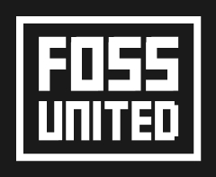

# Transparency

## Transparency reports from Project Segfault

Here we will fill out fiscal reports etc.

File layout is inspired by iv-org's [transparency repo.](https://github.com/iv-org/transparency)

## Grants

Project Segfault is open to grants for the work we do, please feel free to reach out if interested.

We are currently being supported by [FOSS United](https://fossunited.org/grants), an Indian non-profit which aims to promote and strengthen the FOSS ecosystem of India.

If you are a free software developer / maintainer, feel free to [reach out to them](mailto:grants@fossunited.org) for a grant too!

## Public Addresses for wallets

- XMR: `47L7Qsto7XcifY3CdG18ySe5Tt83kpFLDLve9jQwbc9taPBLNGv6ZrJNUKpMG9Nj9zHgCZ4FQMSyt75e8Jvx12JFLtJyFdA`

- BTC: `bc1qrc8ywgp95a6p3zausp4nff70qzstp6h8z86sxd`

- LTC: `ltc1qn3ald586h2ntt0n3zkvwsmju2e5vndgtvvgatj`

## ViewKey for Monero (Advanced)

`feed2cd7deb65937518aadd96d06d36433f1b61fc289a9f3489cdbd120aafc0c`
